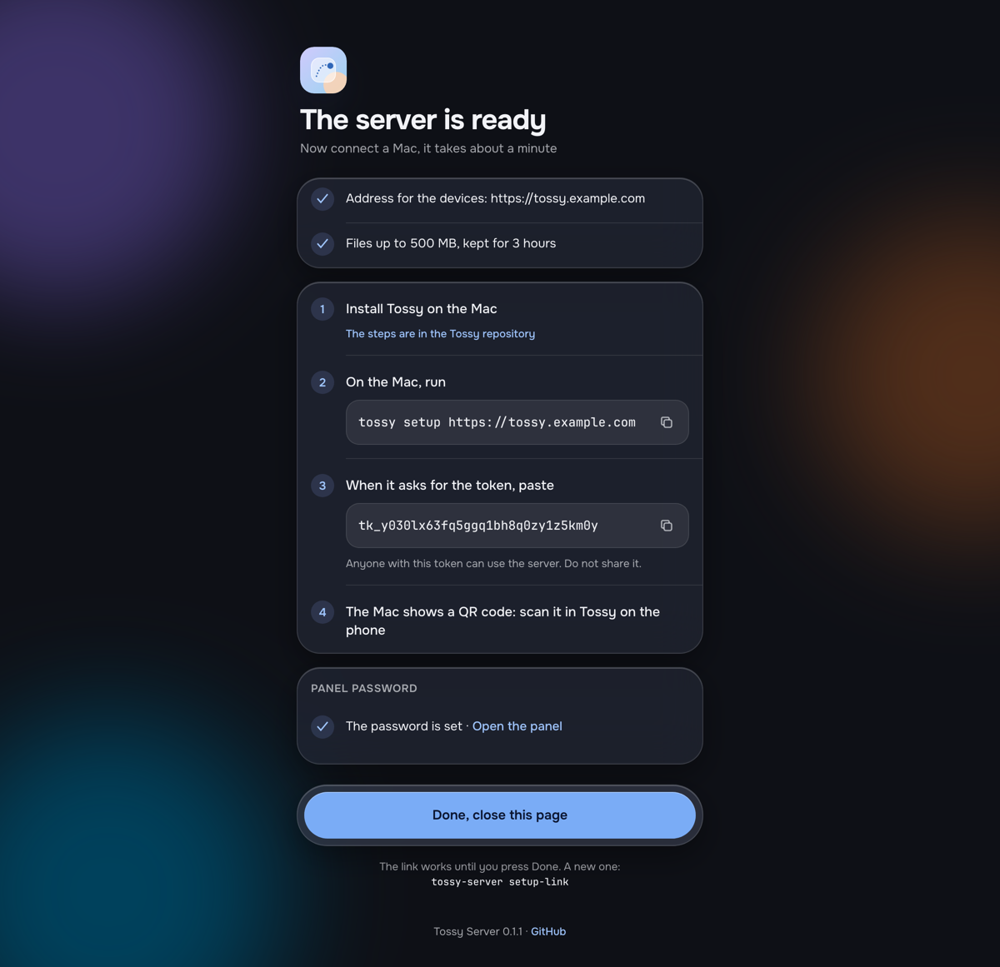
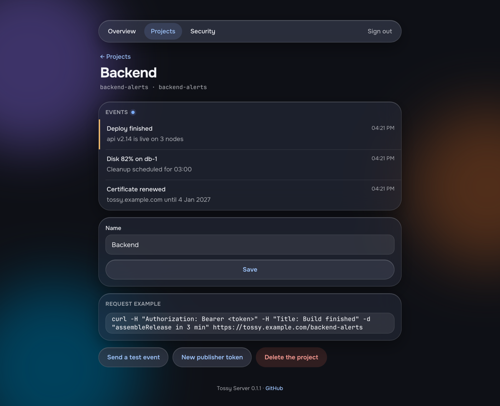
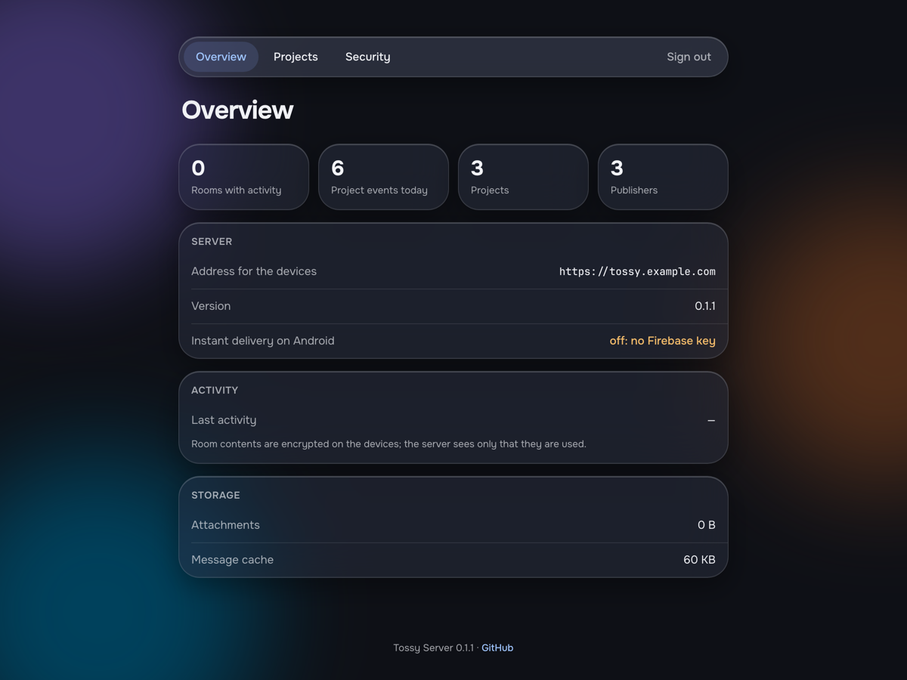

<p align="center">
  
</p>

<h1 align="center">Tossling Server</h1>

<p align="center">
  The server for <a href="https://github.com/tossling/tossling-desktop">Tossling</a>: one clipboard for your computers and Android phone (iOS in progress).<br>
  One Docker container that relays ciphertext and never sees the clipboard.
</p>

<p align="center">
  <a href="https://github.com/tossling/tossling-server/releases/latest"></a>
  <a href="https://github.com/tossling/tossling-server/pkgs/container/tossling-server"></a>
  <a href="LICENSE"></a>
</p>

<p align="center">
  
  &nbsp;
  
</p>

It relays encrypted messages between the devices of a room and keeps attachments for three hours.

Tossling Server is [ntfy](https://github.com/binwiederhier/ntfy) inside, unmodified and embedded as a Go
library, with a Tossling layer in front: a single binary that sets itself up on the first start, its own
web page, and the access rules Tossling needs. Tossling apps and anything that publishes to ntfy keep working.
What the apps send to each other, with test vectors for a new client, is in [docs/PROTOCOL.md](docs/PROTOCOL.md).

Status: early, in daily use by the author. Expect changes before 1.0.

## Docker

Save this as `docker-compose.yml`, set `TOSSLING_BASE_URL` to the address the devices will use, and start it:

```yaml
services:
  tossling-server:
    image: ghcr.io/tossling/tossling-server:latest
    restart: unless-stopped
    ports:
      - "8090:8090"
    environment:
      TOSSLING_BASE_URL: https://tossling.example.com
    volumes:
      - ./data:/data
```

```bash
docker compose up -d
docker compose logs tossling-server
```

The image is built for linux/amd64 and linux/arm64. To build it yourself instead, clone the repository and run
`docker build -t tossling-server .`.

The log of the first start shows a link to the setup page: it checks the address, shows the command
for the Mac and the token, and stops working once you press Done. A new link:
`docker compose exec tossling-server tossling-server setup-link`. Data lives in `./data`.
Put the server behind HTTPS (a reverse proxy such as Caddy or Nginx Proxy Manager) and add
`TOSSLING_BEHIND_PROXY: "true"`; the proxy must accept request bodies up to 600 MB for large files.

## Projects

A project is a channel that services publish events to and every Tossling device shows in Notifications.

```bash
tossling-server project add backend-alerts "Backend"   # in Docker: docker compose exec tossling-server tossling-server project add …
tossling-server project list
tossling-server project remove backend-alerts
```

`add` creates the channel, makes it appear on all devices and prints a token that can only publish to that
channel, with a `curl` example. A service that feeds several channels keeps one token:
`tossling-server project add axrock AxRock --publisher backend` lets the publisher `backend` (created by its
first project) write to one more channel. The devices can read every channel on the server but write only to their
rooms, `mac` and `claude`.

## Web panel

<p align="center">
  
</p>

`/admin` manages the server in the browser: an overview (rooms in use, project events, storage, Firebase), projects with
their recent events (create, rename, send a test event, new publisher token, delete) and security (publishers and when
their tokens were last used, a new setup link, the panel password, signing out everywhere). The password is set on the
setup page or with `tossling-server admin-password`. Sessions last 30 days; sign-in attempts are limited per address.

The same project operations are open to the Tossling apps with the device token: `GET /v1/tossling/projects`,
`POST /v1/tossling/projects` (`{"topic": "…", "name": "…", "publisher": "…"}`, answers with the publisher token once) and
`DELETE /v1/tossling/projects/<channel>`.

## Instant delivery on Android

The Tossling app wakes up through Firebase Cloud Messaging. Set `TOSSLING_FIREBASE_KEY_FILE` to the service account
JSON of the Firebase project the app is built with (mount it into the container). Without it new items reach
the phone when the app opens, unless the app keeps a connection of its own (its «Keep a connection» setting);
`/v1/tossling/health` reports `"push": false` so the app can turn that on by itself.

The health answer also carries `url`, the address from `-base-url`. Apps that reach the server under another
name (an old domain) check that the new address answers with the same token and move there by themselves, so a
server can change its domain: point both names at it, set the new `-base-url`, and drop the old name later.

## Build and run

Go and a C compiler (for SQLite) are needed.

```bash
make build
./build/tossling-server -base-url https://tossling.example.com -data /var/lib/tossling-server
```

On the first start the server creates the device user (`tossy`, the name devices have always used), its access rules and a token, and prints a link
to the setup page; `tossling-server setup-link` prints a new one. `-listen` sets the address (default `:8090`); `-behind-proxy` takes the client
address from `X-Forwarded-For` when a reverse proxy stands in front. Every flag can also come from the
environment: `TOSSLING_BASE_URL`, `TOSSLING_DATA`, `TOSSLING_LISTEN`, `TOSSLING_BEHIND_PROXY=true`, `TOSSLING_FIREBASE_KEY_FILE`.
Only one server may use a data directory at a time.

`make smoke` builds the server, starts it on a free port with empty data and checks the protocol
Tossling relies on.

`make build` copies the ntfy sources of the version in `go.mod` into `third_party/ntfy` and adds the two
placeholder files ntfy expects instead of its web app and docs; nothing else is changed.

## Upgrading from Tossy Server

The project was called Tossy before 0.2. A server from that time upgrades in place: `TOSSY_*` variables are still read,
the settings stay in `tossy-server.json`, and paired devices keep working. Since 0.3 the API lives at `/v1/tossling/…` and
new rooms use `tossling-*` channels; the old `/v1/tossy/…` path and `tossy-*` channels keep working for devices that
still use them.

## Reporting a vulnerability

See [SECURITY.md](SECURITY.md).

## License

GPL-3.0, see LICENSE and NOTICE.
